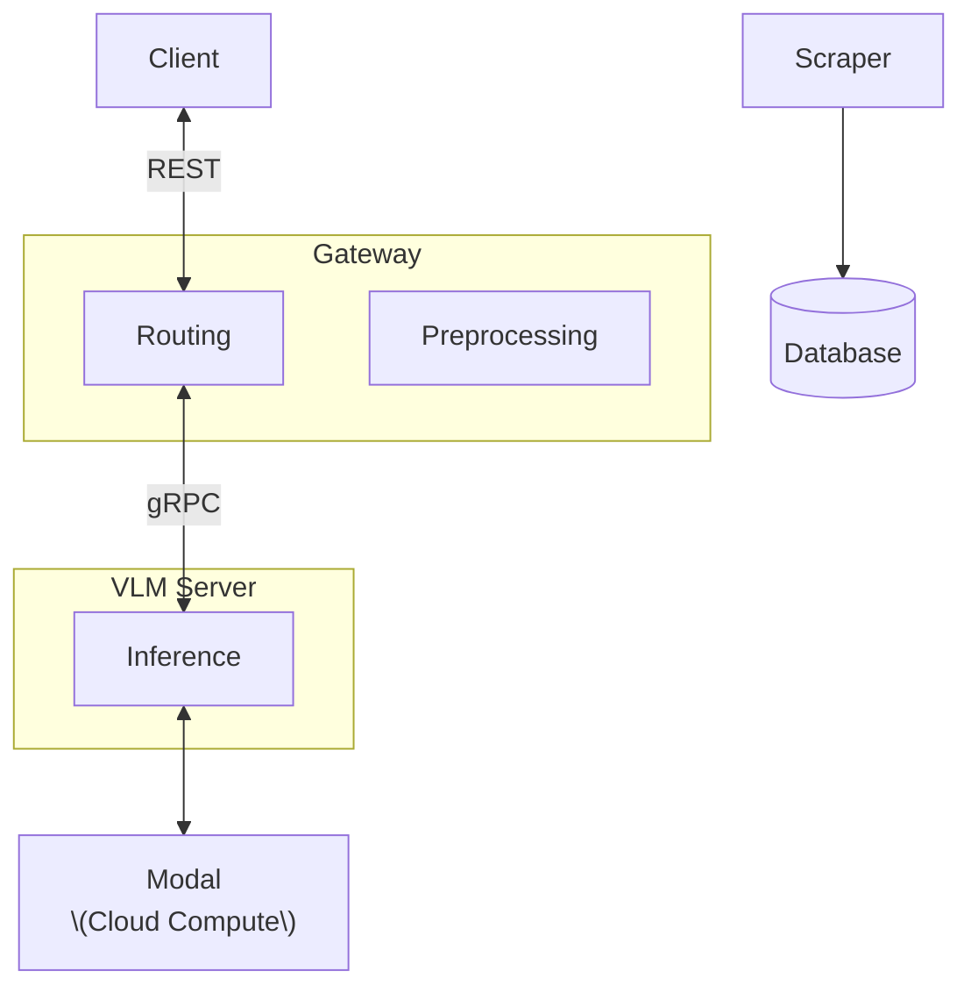

# Gnosis

WIP Gnosis monorepo

## Onboarding and Running the Project

This project uses `uv` for dependency management and virtual environments within a monorepo workspace.

### Setup

1.  **Run Setup Script**:
    Navigate to the project root and run the setup script. This will create a virtual environment, install all project dependencies, and install the workspace packages in editable mode.

    ```bash
    uv run scripts/setup.sh
    ```

2.  **Configure Environment Variables**:
    Copy the example environment file and fill in your specific configurations (e.g., API keys, database connection URL).

    ```bash
    cp .env.example .env
    # Open .env in your editor and fill out the necessary values
    ```

### Running Services

After running the setup script, you can run each service directly using `uv run` and the script name:

- **Start the Gateway Server**:
  The main REST API service.

  ```bash
  uv run gateway-server
  ```

- **Start the VLM Server (Optional)**:
  The inference service.

  ```bash
  uv run vlm-server
  ```

## Deployment with Docker

For production environments, each service can be containerized using Docker. Below is an example `Dockerfile` for the `gateway` service. Similar Dockerfiles can be created for other services.

**Example: `Dockerfile.gateway`**

```dockerfile
# Use a Python base image
FROM python:3.13-slim

# Set working directory
WORKDIR /app

# Copy the service's pyproject.toml and related files
COPY services/gateway/pyproject.toml services/gateway/pyproject.toml
COPY services/gateway/src/ services/gateway/src/
COPY lib/pyproject.toml lib/pyproject.toml
COPY lib/src/ lib/src/

# Install dependencies for the gateway service and the shared library
RUN pip install --no-cache-dir hatchling uv
RUN uv pip install -e lib -e services/gateway

# Expose the port the Gateway service runs on
EXPOSE 8000

# Command to run the Gateway service
CMD ["uvicorn", "services.gateway.src.gateway.server:app", "--host", "0.0.0.0", "--port", "8000"]
```

**How to build and run the Docker image (for Gateway):**

```bash
docker build -t gnosis-gateway -f Dockerfile.gateway .
docker run -p 8000:8000 gnosis-gateway
```

## Architecture



# Tree

```
.
├── data
│   ├── images
│   └── oildata.csv
├── lib
│   ├── pyproject.toml
│   └── src
│       └── lib
│           ├── db
│           │   ├── operations
│           │   └── client.py
│           ├── gRPC
│           │   ├── generated
│           │   └── protos
│           ├── inference
│           ├── models
│           │   └── vlm
│           ├── storage
│           └── utils
├── pyproject.toml
├── scripts
└── services
    ├── eval
    │   ├── pyproject.toml
    │   ├── scripts
    │   │   └── process_and_upload_dataset.py
    │   └── src
    │       └── eval
    │           ├── data
    │           ├── metrics
    │           ├── eval.py
    │           └── models.py
    ├── gateway
    │   ├── pyproject.toml
    │   ├── src
    │   │   └── gateway
    │   │       ├── preprocessing
    │   │       ├── routers
    │   │       └── server.py
    │   └── tests
    │       └── test_inference.py
    └── vlm_server
        ├── pyproject.toml
        ├── src
        │   └── vlm_server
        │       ├── inference
        │       └── server.py
        └── tests
            └── test_grpc_inference.py
```

## HOW TO DO WORK

## ENVIRONMENT

- Make sure to have `uv` on your machine.
- This project targets Python 3.13.

```bash
# Install pre-commit hook (formats with Ruff on commit)
pre-commit install
```

## Commits and formatting

```bash
pre-commit run --all-files # in case you forgot to do this before
```

Workflow should correct all formatting issues and the bot will push the formatting fixes to avoid formatting issues down the road

```bash
git commit -m "[YOUR COOL COMMIT MESSAGE]" # otherwise just commit normally and it should format your code.
```
