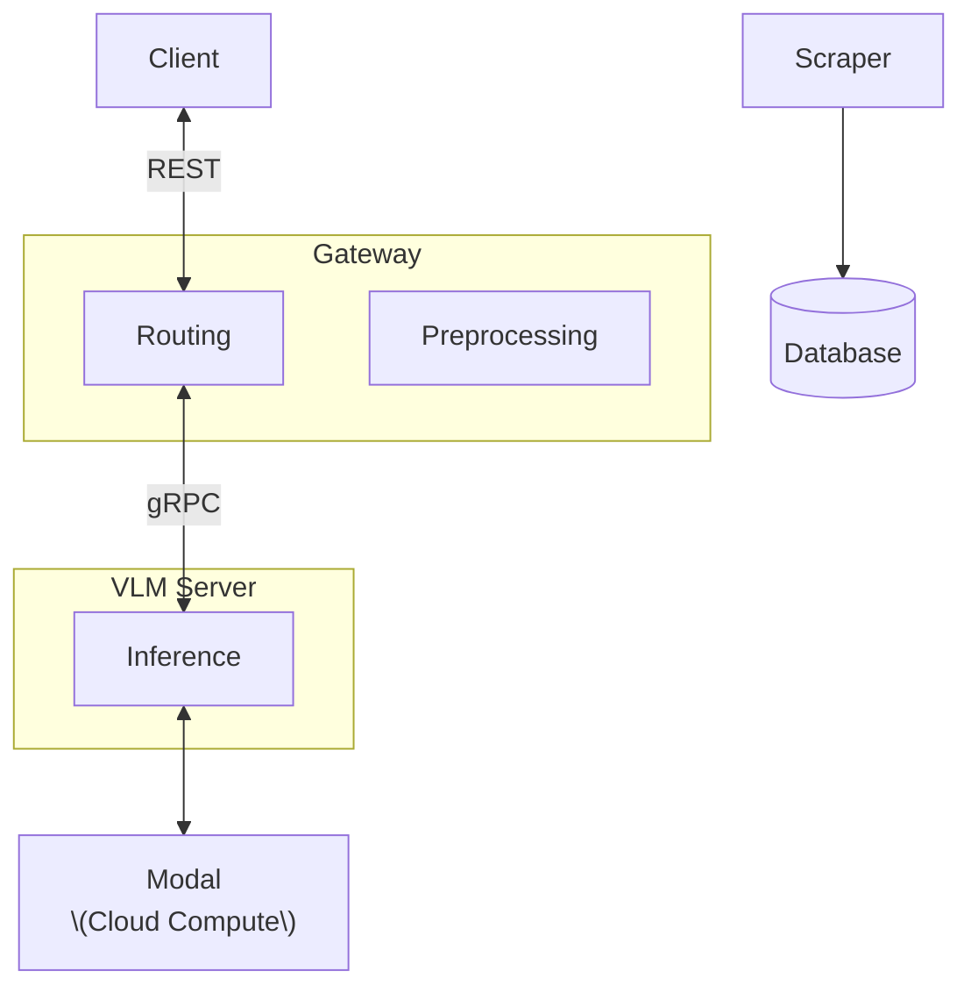

# Gnosis
WIP main Gnosis API gateway.

## Run
```
# start main Gnosis server ('gateway')
cd services/gateway
uv run gateway/server.py

# [optional] start local compute server
cd services/vlm_server
uv run vlm_server/server.py
```

## Architecture


# Tree
```
.
├── data
├── lib # Shared library
│   ├── lib
│   │   ├── gRPC
│   │   ├── models
│   │   └── utils
│   └── pyproject.toml
│
├── services # Servers
│   │
│   ├── gateway # Main API server
│   │   ├── gateway
│   │   │   ├── preprocessing
│   │   │   ├── routers
│   │   │   │   ├── grpc_runner.py
│   │   │   │   ├── health_router.py
│   │   │   │   ├── modal_runner.py
│   │   │   │   └── process_router.py
│   │   │   └── server.py
│   │   │
│   │   ├── test
│   │   └── pyproject.toml
│   │
│   └── vlm_server # Inference server
│       ├── vlm_server
│       │   ├── inference
│       │   │   ├── main.py
│       │   │   ├── prompts
│       │   │   └── vlm
│       │   │       ├── gemini.py
│       │   │       ├── models.json
│       │   │       ├── transformer.py
│       │   │       └── vlm.py
│       │   └── server.py
│       │
│       ├── test
│       └── pyproject.toml
│       
│
├── scripts
└── pyproject.toml
```

## HOW TO DO WORK

## ENVIRONMENT
- Make sure to have uv on your machine. 
- I will change to use python 3.14 but for now just 3.13. Why? Because cooler and **threading is cool**. If you have a problem with this *please forward complaints to HR.*

```bash
# Use uv or else...
uv venv
uv pip install -r requirements.txt
```

```bash
# Install pre-commit hook (formats with Ruff on commit) - ruff is cool because Rust omg rust moment hype
pre-commit install
```

## Commits and formatting
```bash
pre-commit run --all-files # in case you forgot to do this before
```

Workflow should correct all formatting issues and the bot will push the formatting fixes to avoid formatting issues down the road

```bash
git commit -m "[YOUR COOL COMMIT MESSAGE]" # otherwise just commit normally and it should format your code.
```
