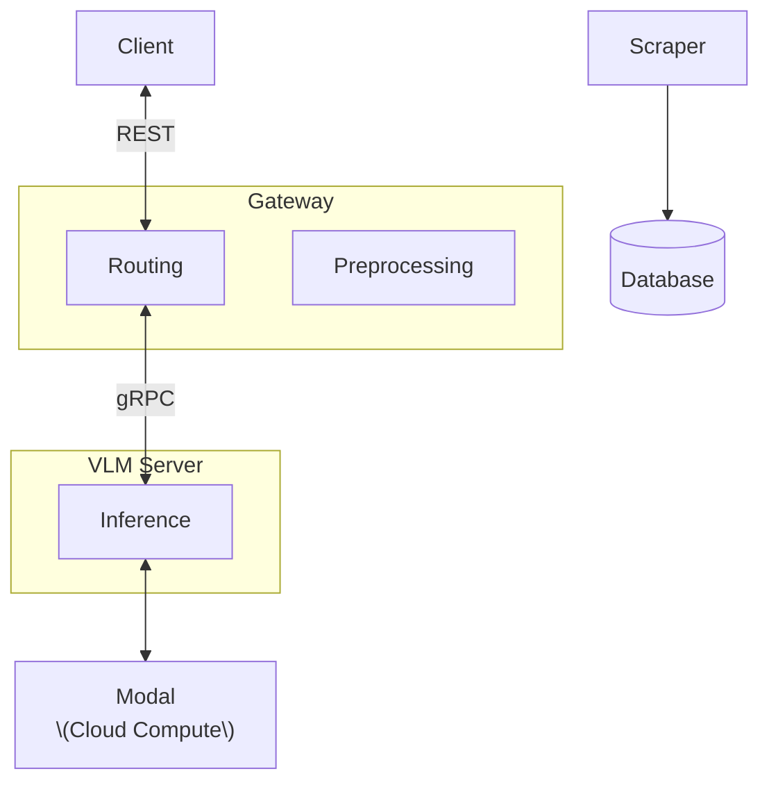

# Gnosis

WIP Gnosis monorepo

## Run

```
# start main Gnosis server ('gateway')
bash scripts/run_gateway.sh

# [optional] start local compute server
bash scripts/run_vlm_server.sh
```

## API

Base URL (default): `http://127.0.0.1:8000`

### Docs

- Swagger UI: `GET /docs`
- Health dashboard: `GET /health/`
- Health JSON: `GET /health/json`

### Inference

`POST /process` (multipart/form-data)

Fields:
- `file` (required): image file upload
- `runner` (optional): `modal` or `local` (default `modal`)
- `config` (required): JSON string matching `InferenceConfig`
- `prompt` (optional): custom prompt

`InferenceConfig` (JSON)
- Required: `model_name`
- Required for Gemini: `output_schema_name` (currently only `"VLMTableOutput"`)
- Optional: `use_gpu`, `dtype`, `max_tokens`, `temperature`, `top_p`, `top_k`,
  `api_key`, `max_model_len`, `model_class`, `device_map`, `return_tensors`,
  `padding`, `attn_implementation`

Example request:
```bash
curl -X POST "http://127.0.0.1:8000/process" \
  -F "file=@/path/to/image.png" \
  -F 'config={"model_name":"gemini-2.5-flash","output_schema_name":"VLMTableOutput"}' \
  -F "runner=modal"
```

Example response (VLMResponseFormat):
```json
{
  "html": null,
  "json_data": "{\"title\":\"...\",\"data\":[{\"x\":1.0,\"y\":2.0}]}",
  "csv": null,
  "text": null,
  "markdown": null,
  "model_name": null,
  "inference_time_ms": 123.4,
  "tokens_used": null
}
```

### Optional queueing

If you want Redis-backed queueing and rate limiting in the gateway:
- `QUEUE_ENABLED=true`
- `REDIS_URL=redis://localhost:6379`
- Optional: `RATE_LIMIT_ENABLED=true`

## Architecture



# Tree

```
.
├── data
│   ├── images
│   └── oildata.csv
├── lib                                        # Shared library
│   ├── pyproject.toml
│   └── src
│       └── lib
|           ├── db
│           │   ├── operations                 # CRUD files for models
│           │   └── client.py
│           ├── gRPC
│           ├── metrics
│                ├──rms.py
│                ├──rnss.py
│                └──tests
│           ├── models
│           │   └── vlm_models.py
│           └── utils
│               ├── image.py
│               ├── log.py
│               └── system.py
├── pyproject.toml
├── scripts
└── services
    ├── gateway                                # Main REST API
    │   ├── pyproject.toml
    │   ├── src
    │   │   └── gateway
    │   │       ├── preprocessing
    │   │       │   ├── main.py
    │   │       │   ├── rotate.py
    │   │       │   └── standardize.py
    │   │       ├── routers
    │   │       │   ├── grpc_runner.py
    │   │       │   ├── health_router.py
    │   │       │   ├── modal_runner.py
    │   │       │   ├── process_router.py
    │   │       └── server.py
    │   └── tests
    │       └── test_inference.py
    └── vlm_server                             # inference server
        ├── pyproject.toml
        ├── src
        │   └── vlm_server
        │       ├── inference
        │       │   ├── main.py
        │       │   ├── prompts
        │       │   └── vlm
        │       │       ├── gemini.py
        │       │       ├── models.json
        │       │       ├── transformer.py
        │       │       └── vlm.py
        │       └── server.py
        └── tests
            └── test_grpc_inference.py
```

## HOW TO DO WORK

## ENVIRONMENT

- Make sure to have uv on your machine.
- I will change to use python 3.14 but for now just 3.13. Why? Because cooler and **threading is cool**. If you have a problem with this _please forward complaints to HR._

```bash
# Use uv or else...
uv venv
uv pip install -r requirements.txt
```

```bash
# Install pre-commit hook (formats with Ruff on commit) - ruff is cool because Rust omg rust moment hype
pre-commit install
```

## Commits and formatting

```bash
pre-commit run --all-files # in case you forgot to do this before
```

Workflow should correct all formatting issues and the bot will push the formatting fixes to avoid formatting issues down the road

```bash
git commit -m "[YOUR COOL COMMIT MESSAGE]" # otherwise just commit normally and it should format your code.
```
