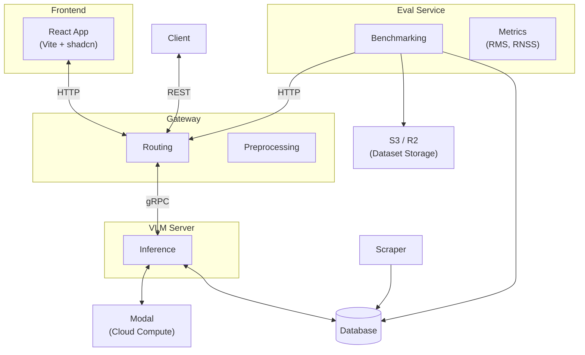

# Gnosis


Gnosis is a VLM (Vision Language Model) evaluation platform for extracting structured data from scanned oil & gas industry documents. It benchmarks multiple VLM backends against ground-truth datasets using custom scoring metrics. Built by [KTH AI Society](https://github.com/kthaisociety).

## Onboarding and Running the Project

This project uses `uv` for dependency management and virtual environments within a monorepo workspace.

### Setup

1.  **Run Setup Script**:
    Navigate to the project root and run the setup script. This will create a virtual environment, install all project dependencies, and install the workspace packages in editable mode.

    ```bash
    uv run scripts/setup.sh
    ```

2.  **Configure Environment Variables**:
    Copy the example environment file and fill in your specific configurations (e.g., API keys, database connection URL).

    ```bash
    cp .env.example .env
    # Open .env in your editor and fill out the necessary values
    ```

3.  **Install Pre-commit Hooks** (formats with Ruff on commit):

    ```bash
    pre-commit install
    ```

### Running Services

After running the setup script, you can run each service directly using `uv run` and the script name:

- **Start the Gateway Server**:
  The main REST API service.

  ```bash
  uv run gateway-server
  ```

- **Start the VLM Server (Optional)**:
  The inference service.

  ```bash
  uv run vlm-server
  ```

## Deployment with Docker

The project includes a `docker-compose.yml` that builds and runs all three services (frontend, gateway, VLM server) in a single network:

```bash
docker compose up --build
```

This starts:

| Service      | Port  | Description                    |
|--------------|-------|--------------------------------|
| `frontend`   | 8080  | React app served via nginx     |
| `gateway`    | 8000  | REST API (FastAPI)             |
| `vlm-server` | 50051 | gRPC inference server          |

Each service has its own `Dockerfile` (`frontend/Dockerfile`, `services/gateway/Dockerfile`, `services/vlm_server/Dockerfile`). Environment variables are configured in the `docker-compose.yml` or via a `.env` file.

## Architecture



## Tree

```
.
├── docker-compose.yml
├── .env.example
├── pyproject.toml
├── data
│   ├── images
│   │   ├── processed
│   │   └── raw
│   └── oildata.csv
├── docs
│   ├── arch_and_comms.md
│   └── neon_schema.sql
├── frontend
│   ├── Dockerfile
│   ├── nginx.conf
│   ├── package.json
│   └── src
│       ├── components
│       ├── hooks
│       ├── pages
│       └── stores
├── lib
│   ├── pyproject.toml
│   └── src
│       └── lib
│           ├── db
│           ├── gRPC
│           │   ├── generated
│           │   └── protos
│           ├── inference
│           ├── models
│           ├── storage
│           └── utils
├── scripts
│   ├── setup.sh
│   ├── gen_grpc_protos.sh
│   ├── format.sh
│   ├── sync.sh
│   ├── dump_schema.sh
│   ├── delete_pycache.sh
│   ├── populate_db_with_models.py
│   ├── read_oildata.py
│   ├── setup_s3_bucket.py
│   ├── models.json
│   └── schema.sql
└── services
    ├── eval
    │   ├── pyproject.toml
    │   ├── scripts
    │   ├── src
    │   │   └── eval
    │   │       ├── data
    │   │       ├── metrics
    │   │       ├── eval.py
    │   │       └── models.py
    │   └── tests
    ├── gateway
    │   ├── Dockerfile
    │   ├── pyproject.toml
    │   ├── src
    │   │   └── gateway
    │   │       ├── preprocessing
    │   │       ├── routers
    │   │       └── server.py
    │   └── tests
    └── vlm_server
        ├── Dockerfile
        ├── modal_app.py
        ├── pyproject.toml
        ├── src
        │   └── vlm_server
        │       ├── inference
        │       └── server.py
        └── tests
```

## Commits and Formatting

```bash
pre-commit run --all-files # in case you forgot to do this before
```

The CI workflow will auto-format and push fixes for any remaining formatting issues.

```bash
git commit -m "[YOUR COOL COMMIT MESSAGE]" # pre-commit hook formats your code automatically
```
