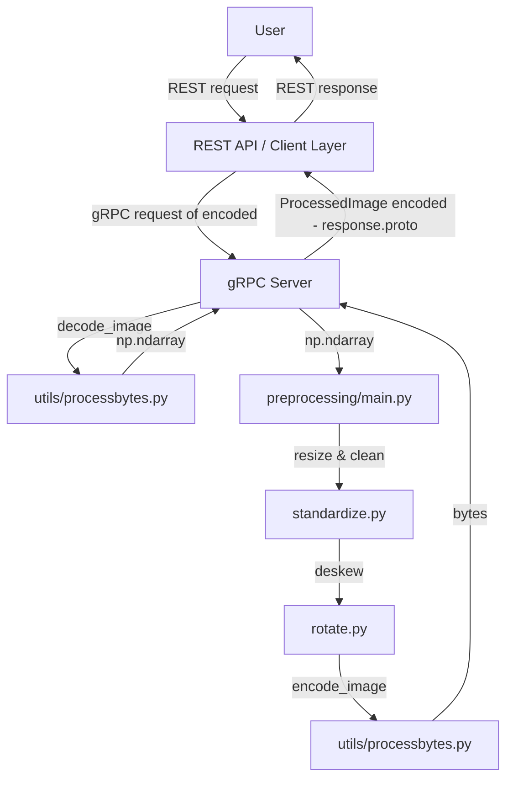

### API structure

- `generated/`: generated protobuf types and gRPC stubs.
- `protos/`: Protobuf code for our comms protocols (you know, the sauce).
- `utils/`: helpers like bytes <-> image conversions.
- `server.py`: actual gRPC server entrypoint.
- `client.py`: internal client for testing (throw a random image at the server).

### Generate protos
```bash
python3 -m grpc_tools.protoc -I gRPC/protos --python_out=gRPC/generated --grpc_python_out=gRPC/generated gRPC/protos/request.proto
```

### API & Service architecture
