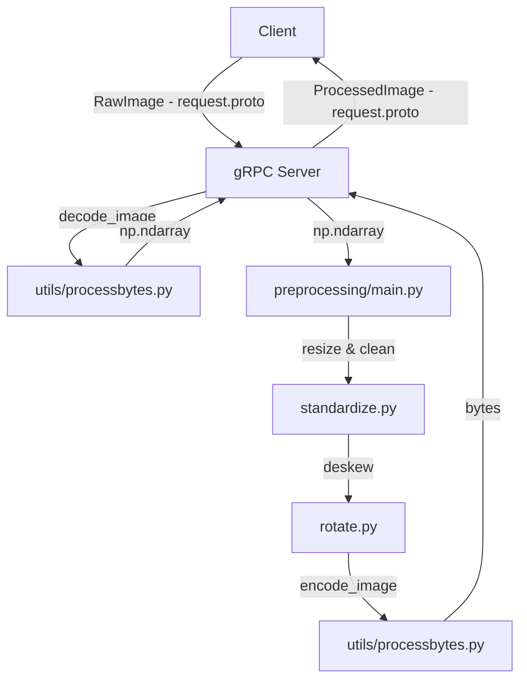

# ARCHITECTURAL DOCS:

### main.py in the inference directory provides a function (inference) to run a model in inference to generate a response. The settings are experimental and currently only the "nanonets/Nanonets-OCR-s" model is supported. This will change with time. For further detail please refer to the README file in the inference directory.

### server.py will assume a function can be imported from infer.py to run inference on this image. Images will arrive as bytes via grpc but have to be converted to PIL images and then passed the same way they used to be.

# DOWNLOAD DotsOCR

### 1. Clone the repo

```bash
cd src
git clone https://github.com/rednote-hilab/dots.ocr.git
cd dots.ocr
```

### 2. Install the package

```bash
pip install -e .
```

### 3. Download model weights

```bash
python3 tools/download_model.py
```

- Note: Use a directory name _without_ periods for the model folder.
- Example: `weights/DotsOCR` (not `dots.ocr`)

# DIAGRAM AND GETTING STARTED

### API structure

- `generated/`: generated protobuf types and gRPC stubs.
- `protos/`: Protobuf code for our comms protocols (you know, the sauce).
- `utils/`: helpers like bytes <-> image conversions.
- `server.py`: actual gRPC server entrypoint.
- `client.py`: internal client for testing (throw a random image at the server).

### Generate protos

```bash
python3 -m grpc_tools.protoc -I src/protos --python_out=src/generated --grpc_python_out=src/generated src/protos/request.proto
```

### API & Service architecture



### Get going with DotsOCR

- Find the DotsOCR repo
- Ue tools/download_model.py to download weights into a nice place. No need for rest of the repo, you can safely delete it.

### SET UP MODAL

```bash
uv run modal setup
```

- For deployment create a modal proxy token in your dashboard and pass along its ID and secret to your .env

However that above is for if you are running it with cli authentication. Below you create the proxy auth tokens which are then required to be placed in the .env file within the scripts folder (~/scripts/.env)

```bash
uv run modal token new --profile gnosis-infer
```

Then when you authenticate go to `~/.modal.toml` and read the token_id and the token_secret and copy them and name them as MODAL_TOKEN_ID and MODAL_TOKEN_SECRET in the .env file.

==IMPORTANT==: both /scripts and /tests need this .env to function with modal's proxy auth. Most important is tests so you can test the modal inference.

