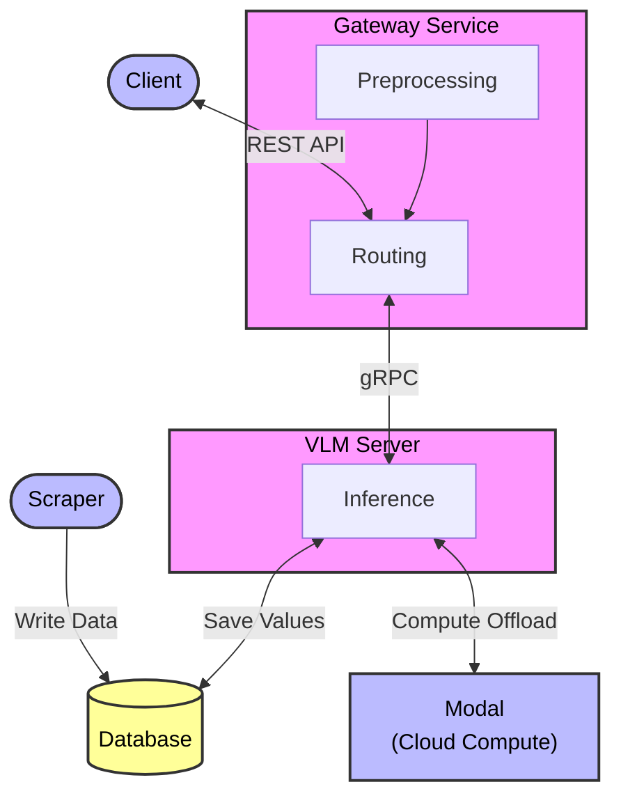
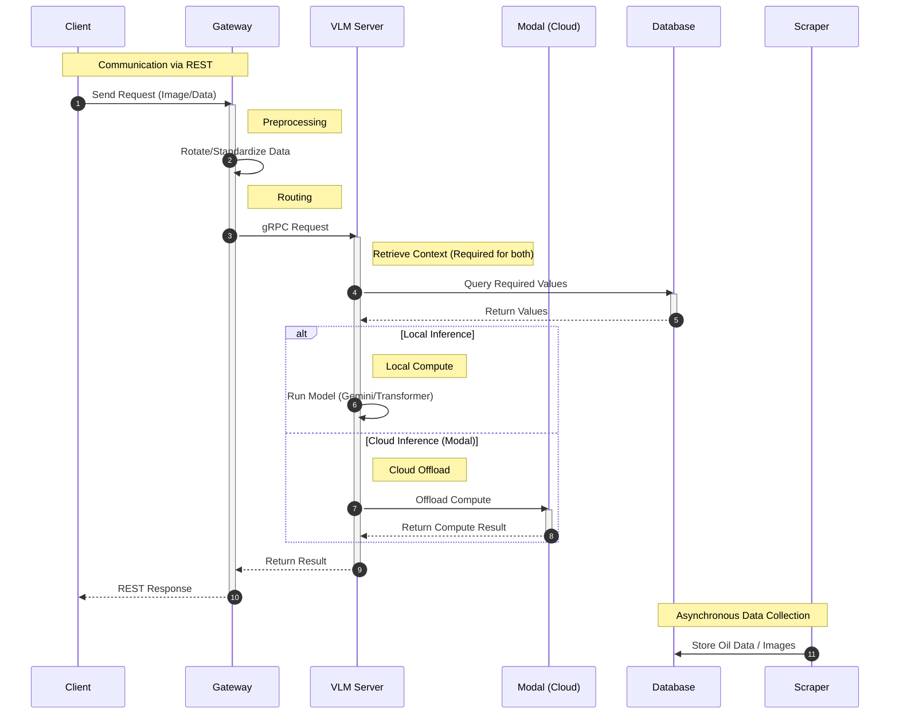

# Architecture

```mermaid
graph TD
    %% Nodes
    Client([Client])
    Scraper([Scraper])
    DB[(Database)]
    Modal["Modal<br>(Cloud Compute)"]

    %% Subgraphs for Services
    subgraph Gateway [Gateway Service]
        direction TB
        Preprocessing
        Routing
        Preprocessing --> Routing
    end

    subgraph VLM [VLM Server]
        Inference
    end

    %% Connections
    Client <-->|REST API| Routing
    Routing <-->|gRPC| Inference
    Inference <-->|Save Values| DB
    Inference <-->|Compute Offload| Modal
    Scraper -->|Write Data| DB

    %% Styling
    classDef service fill:#f9f,stroke:#333,stroke-width:2px,color:#000;
    classDef external fill:#bbf,stroke:#333,stroke-width:2px,color:#000;
    classDef storage fill:#ff9,stroke:#333,stroke-width:2px,color:#000;

    class Gateway,VLM service;
    class Modal,Client,Scraper external;
    class DB storage;
```

---

# Communication

```mermaid
sequenceDiagram
    autonumber
    participant Client
    participant Gateway
    participant VLM as VLM Server
    participant Modal as Modal (Cloud)
    participant DB as Database

    Note over Client, Gateway: Communication via REST
    Client->>Gateway: Send Request (Image/Data)

    activate Gateway
    Note right of Gateway: Preprocessing
    Gateway->>Gateway: Rotate/Standardize Data

    Note right of Gateway: Routing
    Gateway->>VLM: gRPC Request
    activate VLM

    Note right of VLM: Retrieve Context (Required for both)
    VLM->>DB: Query Required Values
    activate DB
    DB-->>VLM: Return Values
    deactivate DB

    alt Local Inference
        Note right of VLM: Local Compute
        VLM->>VLM: Run Model (Gemini/Transformer)
    else Cloud Inference (Modal)
        Note right of VLM: Cloud Offload
        VLM->>Modal: Offload Compute
        activate Modal
        Modal-->>VLM: Return Compute Result
        deactivate Modal
    end

    VLM-->>Gateway: Return Result
    deactivate VLM

    Gateway-->>Client: REST Response
    deactivate Gateway

    Note over Scraper, DB: Asynchronous Data Collection
    Scraper->>DB: Store Oil Data / Images
```
